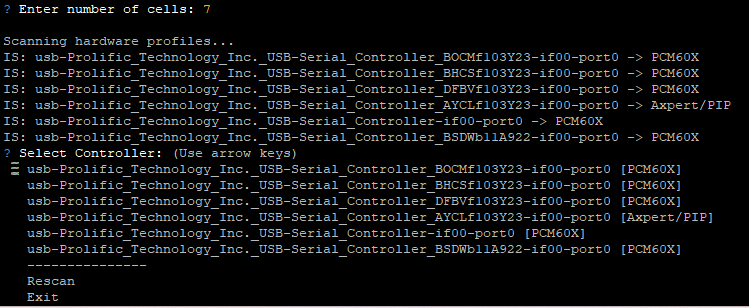
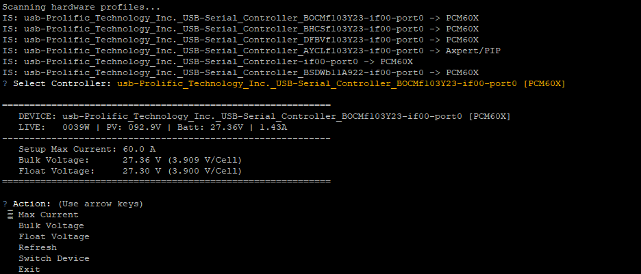

# AXPERT-PCM60X-Configtool-for-Raspberry-PI



A Python-based CLI tool for synchronized management of **MPP Solar PCM60X** charge controllers and **Axpert/PIP** inverters.

Usage with * **Adapters**: **Prolific PL2303** USB-to-Serial adapter.

This tool provides real-time monitoring and parameter configuration through a single interface, specifically optimized for **Raspberry Pi** systems.

---

## 📂 Installation & Setup

For the best experience, place the script in your home directory:

* **Location:** `/home/pi/`
* **Filename:** `pcm60x_config.py`

### Install Dependencies
The script requires `pyserial` for communication and `questionary` for the interactive menu. Run the following command in your terminal:

```bash
pip3 install pyserial questionary
```

---

## 🔋 Cell Configuration (V/Cell)

When you start the script, it will ask for the **number of battery cells** (e.g., `7`, `8`, `14`, or `16`).

### Why is this important?
The script calculates the **Voltage per Cell (V/Cell)** based on this number.

* **Monitoring:** You can immediately see if a specific cell is stressed (e.g., 3.45V instead of 3.20V), rather than just seeing the total voltage of e.g. 54.8V.
* **Precision:** Configuring charging voltages at the cell level is significantly safer for LiFePO4 or Li-Ion batteries.

---

## 🚀 Key Features



* **Automatic Device Recognition**: Automatically detects whether a PCM60X or an Axpert inverter is connected.
* **Live Monitoring**: Displays Wattage, PV voltage, battery voltage, and charging current.
* **Safety Logic**: Prevents incorrect entries (e.g., Bulk voltage must always be >= Float voltage).

---

## 🛠 Hardware Requirements

* **Host**: Raspberry Pi.
* **Adapters**: **Prolific PL2303** USB-to-Serial adapter.
* **Connection**: 2400 Baud.

---

## 🖥 How to Use

Start the script in the terminal:

```bash
python3 /home/pi/pcm60x_config.py
```

1. **Cell Count**: Enter your number of cells (e.g., 16).
2. **Device**: Select the detected adapter.
3. **Menu**: Use the interactive menu to read or modify values.

---

## ⚠️ Technical Notes

* **Write Delays**: After each write command, the script waits **2 seconds** to ensure the hardware safely saves the data to the flash memory.
* **Permissions**: If access is denied, use `sudo` or add your user to the `dialout` group.
